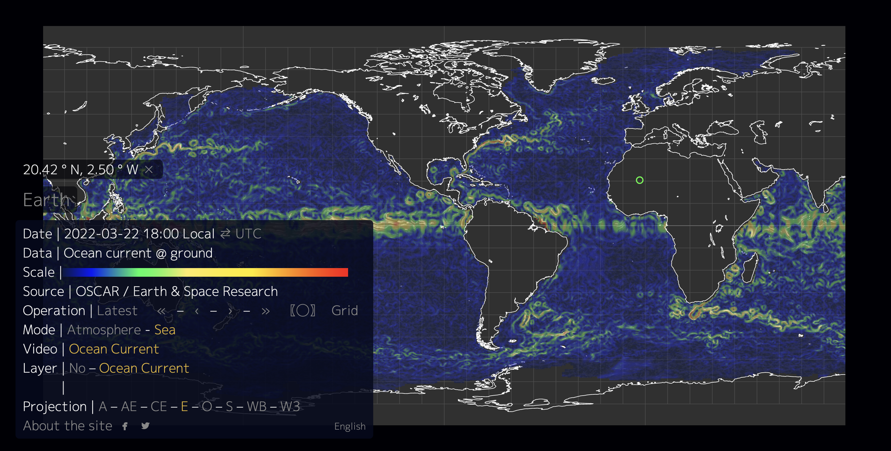
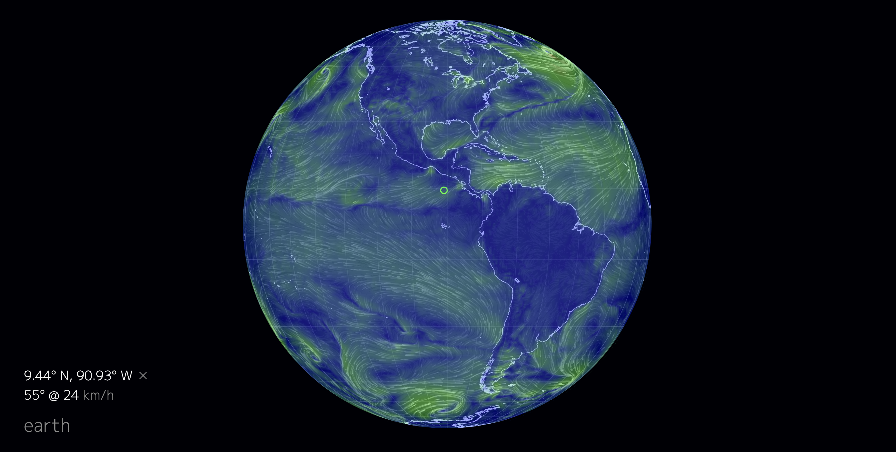
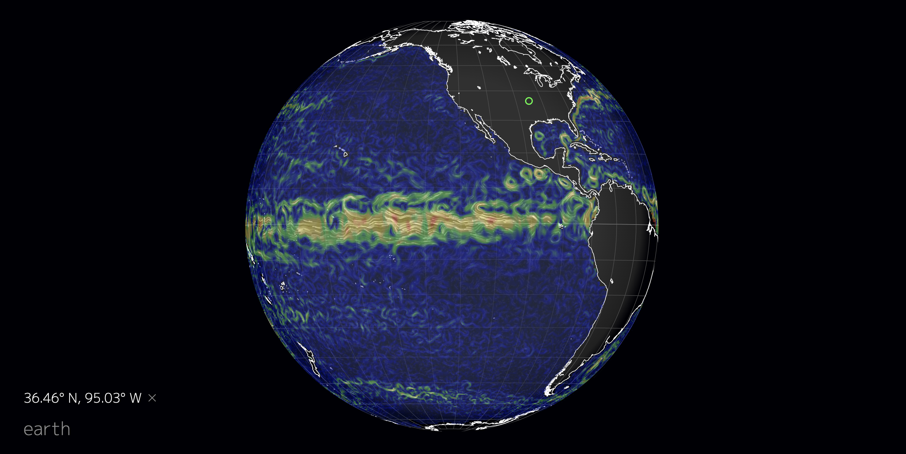

## Visualization of Global Wind and Weather

## Building and Launching
----------------------

After installing node.js and npm,

    cd Visualization of Global Wind and Weather
    npm install

Next, launch the development web server:

    node dev-server.js 8080

Finally, point your browser to:

    http://localhost:8080

The server acts as a stand-in for static S3 bucket hosting and so contains almost no server-side logic. It
serves all files located in the `Visualization of Global Wind and Weather/public` directory. See `public/index.html` and `public/libs/earth/*.js`

Data files are located in the `public/data` directory, and there is one sample
weather layer located at `data/weather/current`.

## Getting the Map Data
----------------

Map data is provided by [Natural Earth](http://www.naturalearthdata.com) but must be converted to
[TopoJSON](https://github.com/mbostock/topojson/wiki) format. We make use of a couple different map scales: a
simplified, larger scale for animation and a more detailed, smaller scale for static display. After installing
[GDAL](http://www.gdal.org/) and TopoJSON (see [here](http://bost.ocks.org/mike/map/#installing-tools)), the
following commands build these files:

    curl "http://www.nacis.org/naturalearth/50m/physical/ne_50m_coastline.zip" -o ne_50m_coastline.zip
    curl "http://www.nacis.org/naturalearth/50m/physical/ne_50m_lakes.zip" -o ne_50m_lakes.zip
    curl "http://www.nacis.org/naturalearth/110m/physical/ne_110m_coastline.zip" -o ne_110m_coastline.zip
    curl "http://www.nacis.org/naturalearth/110m/physical/ne_110m_lakes.zip" -o ne_110m_lakes.zip
    unzip -o ne_\*.zip
    ogr2ogr -f GeoJSON coastline_50m.json ne_50m_coastline.shp
    ogr2ogr -f GeoJSON coastline_110m.json ne_110m_coastline.shp
    ogr2ogr -f GeoJSON -where "scalerank < 4" lakes_50m.json ne_50m_lakes.shp
    ogr2ogr -f GeoJSON -where "scalerank < 2 AND admin='admin-0'" lakes_110m.json ne_110m_lakes.shp
    ogr2ogr -f GeoJSON -simplify 1 coastline_tiny.json ne_110m_coastline.shp
    ogr2ogr -f GeoJSON -simplify 1 -where "scalerank < 2 AND admin='admin-0'" lakes_tiny.json ne_110m_lakes.shp
    topojson -o earth-topo.json coastline_50m.json coastline_110m.json lakes_50m.json lakes_110m.json
    topojson -o earth-topo-mobile.json coastline_110m.json coastline_tiny.json lakes_110m.json lakes_tiny.json
    cp earth-topo*.json <earth-git-repository>/public/data/

## Now Getting the Weather Data,
--------------------

Weather data is produced by the [Global Forecast System](http://en.wikipedia.org/wiki/Global_Forecast_System) (GFS),
operated by the US National Weather Service. Forecasts are produced four times daily and made available for
download from [NOMADS](http://nomads.ncep.noaa.gov/). The files are in [GRIB2](http://en.wikipedia.org/wiki/GRIB)
format and contain over [300 records](http://www.nco.ncep.noaa.gov/pmb/products/gfs/gfs.t00z.pgrbf00.grib2.shtml).
We need only a few of these records to visualize wind data at a particular isobar. The following commands download
the 1000 hPa wind vectors and convert them to JSON format using the [grib2json](https://github.com/cambecc/grib2json)
utility:

    YYYYMMDD=<a date, for example: 20140101>
    curl "http://nomads.ncep.noaa.gov/cgi-bin/filter_gfs.pl?file=gfs.t00z.pgrb2.1p00.f000&lev_10_m_above_ground=on&var_UGRD=on&var_VGRD=on&dir=%2Fgfs.${YYYYMMDD}00" -o gfs.t00z.pgrb2.1p00.f000
    grib2json -d -n -o current-wind-surface-level-gfs-1.0.json gfs.t00z.pgrb2.1p00.f000
    cp current-wind-surface-level-gfs-1.0.json <earth-git-repository>/public/data/weather/current

## Implementaion of the Code,
--------------------

Building this project required solutions to some interesting problems. Here are a few:

   * The GFS grid has a resolution of 1°. Intermediate points are interpolated in the browser using [bilinear
     interpolation](http://en.wikipedia.org/wiki/Bilinear_interpolation). This operation is quite costly.
   * Each type of projection warps and distorts the earth in a particular way, and the degree of distortion must
     be calculated for each point (x, y) to ensure wind particle paths are rendered correctly. For example,
     imagine looking at a globe where a wind particle is moving north from the equator. If the particle starts
     from the center, it will trace a path straight up. However, if the particle starts from the globe's edge,
     it will trace a path that curves toward the pole. [Finite difference approximations](http://gis.stackexchange.com/a/5075/23451)
     are used to estimate this distortion during the interpolation process.
   * The earth's SVG map is overlaid with an HTML5 Canvas, which is where the animation is created. A coloured overlay is displayed via another HTML5 Canvas that sits on top. Both canvases must know where the globe's bounds are produced by the SVG engine, but getting this pixel-by-pixel information from the SVG elements is tricky. To get around this, the globe's bounding sphere is re-rendered to a separate Canvas element, with the Canvas pixels acting as a mask to detect points that are outside the enclosing sphere.
   * Most configuration options are persisted in the hash fragment to allow deep linking and back-button
     navigation. We use a [backbone.js Model](http://backbonejs.org/#Model) to represent the configuration.
     Changes to the model persist to the hash fragment (and vice versa) and trigger "change" events which flow to
     other components.
   * Components use [backbone.js Events](http://backbonejs.org/#Events) to trigger changes in other downstream
     components.

## Outputs
-----------

